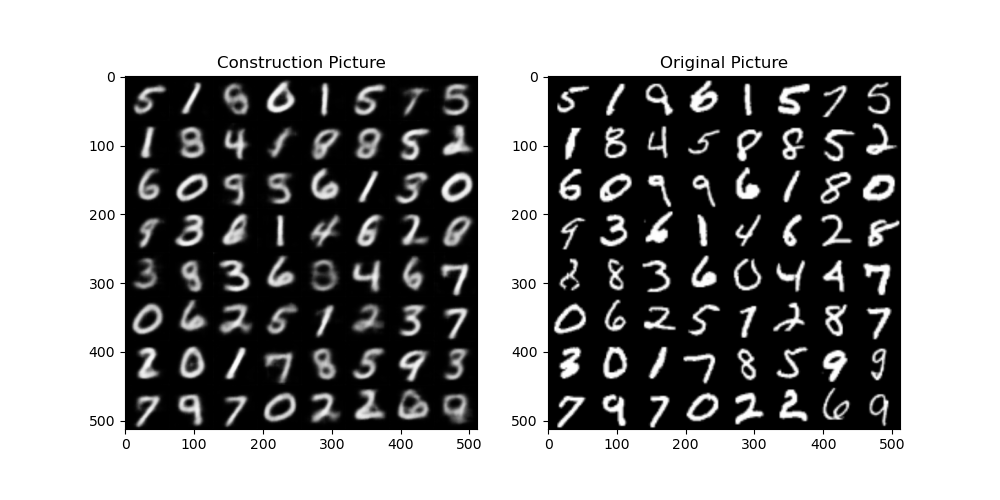
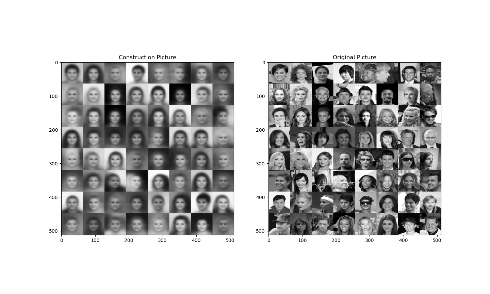

VAE experiment result

</img>

</img>

#### The induction of variational autoencoder

image : x   latent varible : z

Assumption : p(z) ~ N(0, I), p(x|z) ~ Gaussion Distribution, p(z|x) unknown

we want to use q(z|x) to approximate p(z|x)

KL-Divergence characterizes the difference of distribution between $q(z|x)$, $p(z|x)$

$$
\begin{aligned}
D_{KL}(q(z|x) || p(z|x)) & = \int_z q(z|x) log \frac{q(z|x)}{p(z|x)} dz\\
&= \int_z q(z|x) log\frac{q(z|x) p(x)}{p(x,z)} dz \\
&= \int_z q(z|x) logp(x)dz + \int_z q(z|x) log\frac{q(z|x)}{p(x,z)}dz \\
&= logp(x) + E_{q(z|x)}(log\frac{q(z|x)}{p(x,z)})\\
\end{aligned}
$$

$$
\begin{aligned}
logp(x) &= D_{KL}(q(z|x) || p(z|x)) - E_{q(z|x)}(log\frac{q(z|x)}{p(x,z)}) \\
&= D_{KL}(q(z|x) || p(z|x)) + E_{q(z|x)}(log\frac{p(x,z)}{p(z|x)}) \\
&\geq E_{q(z|x)}(log\frac{p(x,z)}{q(z|x)}) = E_{q(z|x)}(log\frac{p(x|z)p(z)}{q(z|x)})\\
&= E_{q(z|x)}(logp(x|z)) - D_{KL}(q(z|x) || p(z))\\
\end{aligned}
$$

The target is to maximize $logp(x)$, it is equivalent to maximize $E_{q(z|x)}(logp(x|z))$ and minimize KL-Divergence. 

We assume $q(z|x) \sim N(\mu, diag(\sigma_1^2, ..., \sigma_n^2))$

$$
\begin{aligned}
D_{KL}(q(z_i|x) || p(z_i)) &= \int_{z_i} q(z_i | x) log\frac{q(z_i|x)}{p(z_i)} dz_i  \\
&= \int_{z_i} N(\mu_i, \sigma_i^2) \\
&\geq E_{q(z|x)}(log\frac{p(x,z)}{q(z|x)}) = E_{q(z|x)}(log\frac{p(x|z)p(z)}{q(z|x)})\\
&= E_{q(z|x)}(logp(x|z)) - D_{KL}(q(z|x) || p(z))\\
\end{aligned}
$$

$$
\begin{aligned}
D_{KL}(q(z_i|x)||p(z_i)) &= \int_{z_i} N(z_i;\mu_i(x), \sigma_i(x)) ln \frac{N(z_i;\mu_i(x), \sigma_i(x))}{N(z_i;0, 1)} dz \\
&= \int_{z_i} N(z_i;\mu_i(x), \sigma_i(x)) ln\frac{exp(-\frac{(z_i - \mu_i(x))^2}{2\sigma_i^2(x)} + \frac{z_{i}^2}{2} )}{\sigma_i(x)} dz \\
&= \int_{z_i} N(z;\mu_i(x), \sigma_i(x)) [(-\frac{(z_i - \mu_i(x))^2}{2\sigma_i^2(x)} + \frac{z_{i}^2}{2} ) - ln\sigma_i(x) ]dz \\
&= -\frac{1}{2} + \frac{\mu_i^2(x) + \sigma_i^2(x)}{2} - ln\sigma_i(x) \\
&= \frac{1}{2}(\mu_i^2(x) + \sigma_i^2(x) - 1 - ln\sigma_i(x)^2)
\end{aligned}
$$

Hence, $D_{KL}(q(z_i|x)||p(z_i)) = \sum_i \frac{1}{2}(\mu_i^2(x) + \sigma_i^2(x) - 1 - ln\sigma_i(x)^2)$

As for $E_{q(z|x)}(logp(x|z))$:

$$
\begin{aligned}
E_{q(z|x)}(logp(x|z)) & \approx \frac{1}{m}\sum_{i=1}^{m}logp(x|z_i) \\
&= \frac{1}{m}\sum_{i=1}^{m} log \frac{exp[-\frac{1}{2}(x - \mu)^T \Sigma^{-1} (x - \mu)]}{\sqrt{2\pi^k|\Sigma|}} \\
&= \frac{1}{m}\sum_{i=1}^{m} -\frac{1}{2}[(x - \mu)^T \Sigma^{-1} (x - \mu) - log \sqrt{2\pi^k|\Sigma|}] \\
&= \frac{1}{m}\sum_{i=1}^{m} [-\frac{1}{2}( \sum_j  \frac{(x_j - \mu_j)^2}{\sigma_j^2}) - log \sqrt{2\pi^k|\Sigma|}] \\
& \propto_{\mu, \sigma} MSE(x, \mu)
\end{aligned}
$$
