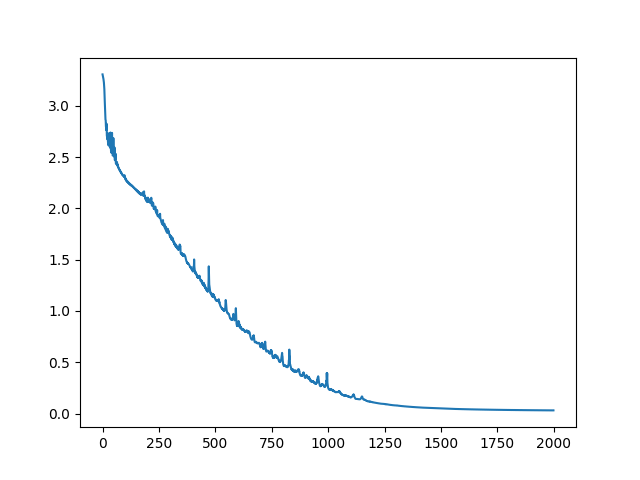
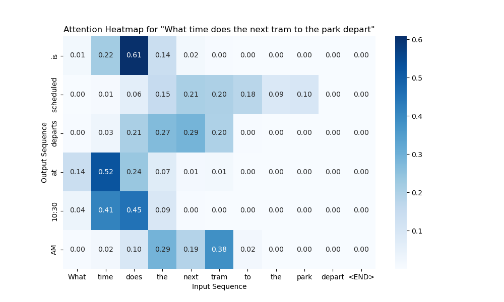

This model is a simple model based on RNN plus cross  attention mechanism. This model is a demo for a simple question answering system.

Word bag/ Dataset: <a href="https://github.com/Stanwang218/ai-from-scratch/blob/main/NLP/seq2seq/answer.txt">answer.txt</a>, <a href="https://github.com/Stanwang218/ai-from-scratch/blob/main/NLP/seq2seq/question.txt">question.txt</a>

The model can be seen in <a href="https://github.com/Stanwang218/ai-from-scratch/blob/main/NLP/seq2seq/rnn.py">rnn.py</a>

Loss for our RNN model

</img>

Attention Map for our result:

Question: What time does the next tram to the park depart

Model output: is scheduled departs at 10:30 AM...

The corresponding attention map

</img>